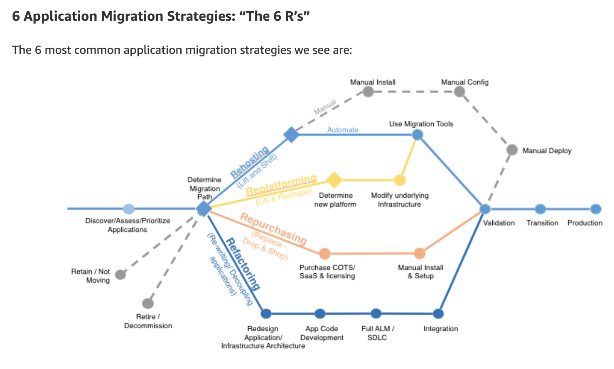

## Week 1 Readings/Resources

------

This week is focused on defining migration, and starting to understand the need for proper planning and assessment before taking migration actions. The notes here are meant to provide further information for you as you continue your study of migration and AWS. 

### AWS Cloud Adoption Framework (AWS CAF)

The [AWS Cloud Adoption Framework (AWS CAF)](https://aws.amazon.com/professional-services/CAF/) organizes guidance into six areas of focus, called perspectives. Each perspective covers distinct responsibilities owned or managed by functionally related stakeholders. In general, the Business, People, and Governance Perspectives focus on business capabilities; while the Platform, Security, and Operations Perspectives focus on technical capabilities.

This content is part of [Amazon Web Services (AWS) Prescriptive Guidance](https://docs.aws.amazon.com/prescriptive-guidance/latest/mrp-solution/overview.html), which provides time-tested strategies, guides, and patterns to help accelerate your cloud adoption

### 6 Strategies for Migrating Applications to the Cloud

[This post ](https://aws.amazon.com/blogs/enterprise-strategy/6-strategies-for-migrating-applications-to-the-cloud/)outlines 6 different migration strategies we see customers implement to migrate applications to the cloud. Using this knowledge, you can begin to outline a plan on how you’ll approach migrating each of the applications in your portfolio, and in what order.

1. **Rehosting** — Otherwise known as “lift-and-shift.”

We find that many [early cloud projects](http://amzn.to/getting-started-with-cloud) gravitate toward net new development using cloud-native capabilities, but in a large legacy migration scenario where the organization is looking to scale its migration quickly to meet a business case, we find that the majority of applications are rehosted. [GE Oil & Gas](https://aws.amazon.com/solutions/case-studies/ge-oil-gas/), for instance, found that, even without implementing any cloud optimizations, it could save roughly 30 percent of its costs by rehosting.

Most rehosting can be automated with tools (e.g. [CloudEndure Migration](https://aws.amazon.com/cloudendure-migration/), [AWS VM Import/Export](https://aws.amazon.com/ec2/vm-import/)), although some customers prefer to do this manually as they learn how to apply their legacy systems to the new cloud platform.

We’ve also found that applications are easier to optimize/re-architect once they’re already running in the cloud. Partly because your organization will have developed better skills to do so, and partly because the hard part — migrating the application, data, and traffic — has already been done.

2. **Replatforming** — I sometimes call this “lift-tinker-and-shift.”

Here you might make a few cloud (or other) optimizations in order to achieve some tangible benefit, but you aren’t otherwise changing the core architecture of the application. You may be looking to reduce the amount of time you spend managing database instances by migrating to a database-as-a-service platform like Amazon Relational Database Service ([Amazon RDS](https://aws.amazon.com/rds)), or migrating your application to a fully managed platform like [Amazon Elastic Beanstalk](https://aws.amazon.com/elasticbeanstalk/).

A large media company we work with migrated hundreds of web servers it ran on-premises to AWS, and, in the process, it moved from WebLogic (a Java application container that requires an expensive license) to [Apache Tomcat](http://tomcat.apache.org/), an open-source equivalent. This media company saved millions in licensing costs on top of the savings and agility it gained by migrating to AWS.

3. **Repurchasing** — Moving to a different product.

I most commonly see repurchasing as a move to a SaaS platform. Moving a CRM to [Salesforce.com](https://www.salesforce.com/), an HR system to [Workday](https://www.workday.com/), a CMS to [Drupal](https://www.drupal.org/), and so on.

4. **Refactoring / Re-architecting** — Re-imagining how the application is architected and developed, typically using cloud-native features.

This is typically driven by a strong business need to add features, scale, or performance that would otherwise be difficult to achieve in the application’s existing environment.

Are you looking to migrate from a monolithic architecture to a service-oriented (or server-less) architecture to boost agility or improve business continuity (I’ve heard stories of mainframe fan belts being ordered on e-bay)? This pattern tends to be the most expensive, but, if you have a good product-market fit, it can also be the most beneficial.

5. **Retire** — Get rid of.

Once you’ve discovered everything in your environment, you might ask each functional area who owns each application. We’ve found that as much as 10% (I’ve seen 20%) of an enterprise IT portfolio is no longer useful, and can simply be turned off. These savings can boost the business case, direct your team’s scarce attention to the things that people use, and lessen the surface area you have to secure.

6. **Retain** — Usually this means “revisit” or do nothing (for now).

Maybe you’re still riding out some depreciation, aren’t ready to prioritize an application that was recently upgraded, or are otherwise not inclined to migrate some applications. You should only migrate what makes sense for the business; and, as the gravity of your portfolio changes from on-premises to the cloud, you’ll probably have fewer reasons to retain.

### How to Migrate

The[ four-phase migration process](https://aws.amazon.com/cloud-migration/how-to-migrate/) is designed to help your organization approach a migration of tens, hundreds, or thousands of applications. While each phase is a common component of a successful migration, they are not discrete phases, but an iterative process.
