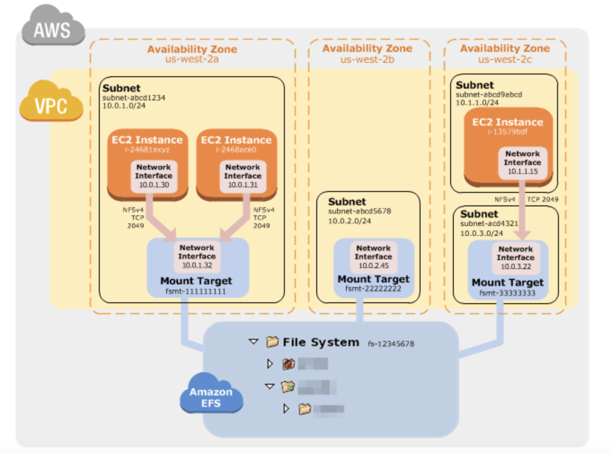

## Week 3 Readings/Resources

------

Week 3 carries further the conversation of preparation, but looks further into the specific AWS services and resources that can help you by either assisting in the transfer of your data, or by acting as your data storage solution within AWS. It is important to evaluate and test the AWS resources you’ll be using just as much as you tested and evaluated your on-prem resources and applications.

### AWS Storage Services

AWS has many storage services that you are able to utilize for both block and object storage options, and within those services there are multiple options for you to evaluate. Finding the correct tool for the specific needs you have will be one of the most important tasks while you’re migrating. Checkout the following links to learn more about each topic:

- [Amason Elastic File System (Amazon EFS)](https://docs.aws.amazon.com/efs/latest/ug/how-it-works.html)
- [Amazon Elastic Block Store (Amazon EBS)](https://docs.aws.amazon.com/AWSEC2/latest/UserGuide/AmazonEBS.html)
- [Amason EBS Volume Types](https://docs.aws.amazon.com/AWSEC2/latest/UserGuide/EBSVolumeTypes.html)
- [Amason Simple Storage Service (Amazon S3)](https://docs.aws.amazon.com/AmazonS3/latest/dev/Introduction.html)

###  Data Transfer

Just as you should understand that secure data transfer is important, you should also consider that there are different types and styles of data transfer between environments. Whether a one-time migration, or ongoing data synchronization across environments, there are tools within AWS that can assist. Checkout the following links to learn more about each topic:

- [AWS Storage Gateway](https://docs.aws.amazon.com/storagegateway/latest/userguide/WhatIsStorageGateway.html)
- [AWS DataSync](https://docs.aws.amazon.com/datasync/latest/userguide/how-datasync-works.html)
- [AWS Snowball](https://docs.aws.amazon.com/snowball/latest/ug/snowball-transfer-client.html)
- [AWS Snowball FAQs](https://aws.amazon.com/snowmobile/faqs/)

### AWS Server Migration Services

[AWS Server Migration Service (AWS SMS)](https://docs.amazonaws.cn/en_us/server-migration-service/latest/userguide/server-migration.html) automates the migration of your on-premises VMware vSphere, Microsoft Hyper-V/SCVMM, and Azure virtual machines to the AWS Cloud. AWS SMS incrementally replicates your server VMs as cloud-hosted Amazon Machine Images (AMIs) ready for deployment on Amazon EC2. Checkout [AWS Server Migration Service FAQs](https://aws.amazon.com/server-migration-service/faqs/) for more info.

###  Amazon Aurora

Amazon Aurora is a fully managed relational database engine that's compatible with MySQL and PostgreSQL. You already know how MySQL and PostgreSQL combine the speed and reliability of high-end commercial databases with the simplicity and cost-effectiveness of open-source databases. The code, tools, and applications you use today with your existing MySQL and PostgreSQL databases can be used with Aurora. Here's a quick [overview of Amazon Aurora](https://docs.aws.amazon.com/AmazonRDS/latest/AuroraUserGuide/CHAP_AuroraOverview.html) and [how Aurora Serverless works](https://docs.aws.amazon.com/AmazonRDS/latest/AuroraUserGuide/aurora-serverless.how-it-works.html).

###  AWS DMS and AWS SCT

With AWS DMS, you can perform one-time migrations, and you can replicate ongoing changes to keep sources and targets in sync. Checkout [How AWS Database Migration Service Works ](https://docs.aws.amazon.com/dms/latest/userguide/CHAP_Introduction.html)for more info. If you want to change database engines, you can use the [AWS Schema Conversion Tool (AWS SCT) ](https://docs.aws.amazon.com/SchemaConversionTool/latest/userguide/CHAP_Welcome.html)to translate your database schema to the new platform. You then use AWS DMS to migrate the data. 
